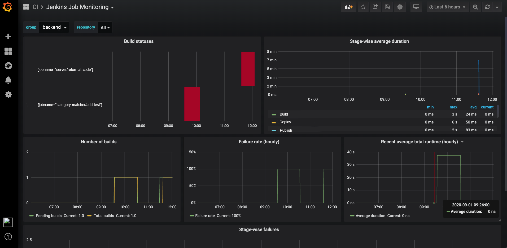

# Jenkins Jobmon 

[](https://github.com/grofers/jenkins-jobmon/actions)

Jenkins exporter for Prometheus in python.

It uses [Prometheus custom collector API][1], which allows making custom
collectors by proxying metrics from other systems.

Currently we fetch following metrics:

| Metric | Type | Description | Labels |
| ------ | ---- | ----------- | ------ |
| `jenkins_job_monitor_total_duration_seconds_sum` | Gauge | Jenkins build total duration in millis | `jobname`, `group`, `repository` |
| `jenkins_job_monitor_fail_count` | Gauge | Jenkins build fail counts | `jobname`, `group`, `repository` |
| `jenkins_job_monitor_total_count` | Gauge | Jenkins build total counts | `jobname`, `group`, `repository` |
| `jenkins_job_monitor_pass_count` | Gauge | Jenkins build pass counts | `jobname`, `group`, `repository` |
| `jenkins_job_monitor_pending_count` | Gauge | Jenkins build pending counts | `jobname`, `group`, `repository` |
| `jenkins_job_monitor_stage_duration` | Gauge | Jenkins build stage duration in ms | `jobname`, `group`, `repository`, `stagename`, `build` |
| `jenkins_job_monitor_stage_pass_count` | Counter | Jenkins build stage pass count | `jobname`, `group`, `repository`, `stagename` |
| `jenkins_job_monitor_stage_pass_duration_sum` | Gauge | Duration of passing stages | `jobname`, `group`, `repository`, `stagename` |
| `jenkins_job_monitor_stage_fail_count` | Counter | Jenkins build stage fail count | `jobname`, `group`, `repository`, `stagename` |
| `jenkins_job_monitor_stage_fail_duration_sum` | Gauge | Duration of failing stages | `jobname`, `group`, `repository`, `stagename` |

## Usage

### Configuration

Create a file `config.yml` using this template:
```yaml
jobs:
  example:          # Put your repo name here
    team: example   # Put your team name
```
Replace `team name` and `repo name` with the repos to be monitored.

### Helm

Add jenkins-jobmon helm repository:

```
helm repo add jenkins-jobmon https://raw.githubusercontent.com/grofers/jenkins-jobmon/master/helm-charts
```

Create a kubernetes ConfigMap from `config.yml`:
```
kubectl create configmap jenkins-jobmon-config --from-file=config.yml
```

Create a kubernetes secret for storing Jenkins username and password:
```
kubectl create secret generic jenkins-jobmon-secrets \
    --from-literal=username=username \
    --from-literal=password=password
```

Deploy Jenkins Jobmon:
```
helm install jenkins-jobmon/jenkins-jobmon --generate-name \
    --set config.jenkinsServer=http://jenkins.example.com \
    --set config.secretName=jenkins-jobmon-secrets \
    --set config.configMapName=jenkins-jobmon-config \
    --set image.repository=$IMAGE \
    --set image.tag=$TAG
```

### Docker

```
docker run -p 9118:9118 \
    -e JENKINS_SERVER=http://jenkins.example.com \
    -e JENKINS_USER=username \
    -e JENKINS_PASSWORD=password \
    -v $(pwd)/config.yml:/usr/src/app/config.yml $IMAGE:$TAG
```
## Setup Development Environment

- Create a virtualenv using `virtualenv env`
- Activate virtualenv using `source ./env/bin/activate`
- Run `pip install -r requirements.txt -r requirements-dev.txt` to install requirements
- Run tests using `make test`


## Grafana 
We have provided a Grafana dashboard in `grafana` directory. You can import it and configure your 
datasource to visualise metrics.



[1]: https://github.com/prometheus/client_python#custom-collectors
